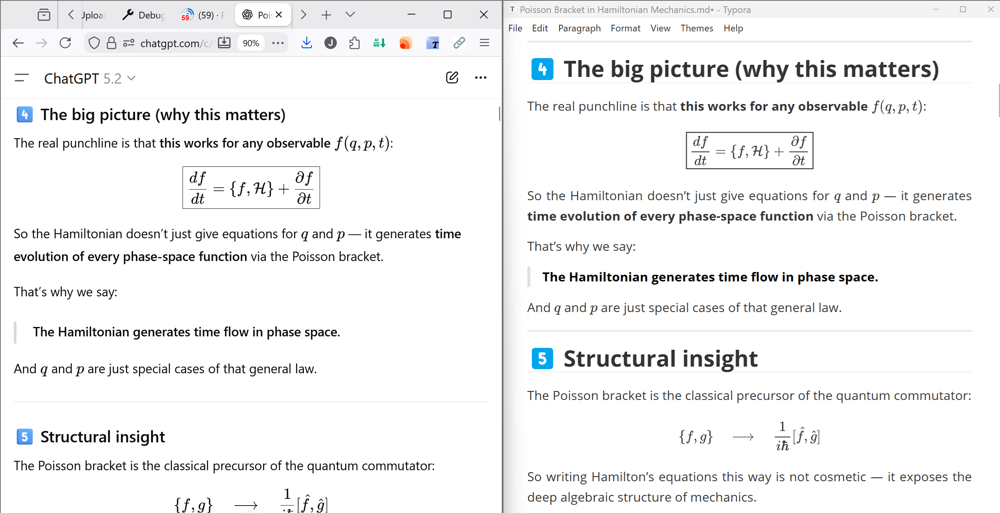
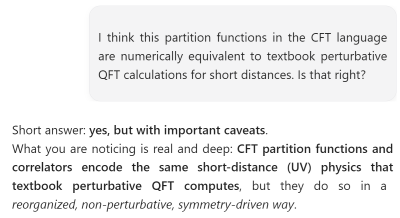

# Yet another ChatGPT exporter

This is a Firefox extension to export ChatGPT conversations from the [chatgpt.com](https://chatgpt.com) to clean Markdown, including custom template support of the export process. This extension is intended for users who do not have API access but want to download a clean Markdown version of their conversations. 

It is a healthy habit to download local versions of valuable conversations for future reference to future proof them since conversation links can and do "rot" (there is no persistence commitment from openAI) and hand picked saving helps one to highlight important exchanges from the noise. Saving to local Markdown lets to adjoint the conversations to other annotation user content, so users can cross-reference and further integrate personal and AI-produced content with dedicated tools/workflow.

Since ChatGPT conversations can get very long, the tool lets the user to select what questions he wants to export (can select all of them) from conversation snippet hints.

The export process is highly customizable, letting you to configure your own export profiles each targeting the exact Markdown variety that the tools in your workflow expect, say Obsidian, Typora, etc. 

For instance one can format questions as Obsidian *callouts*, and control the callout (or "admonition") visual aspect with an Obsidian plugin such as the [admonition plugin](https://github.com/javalent/admonitions), and adding your desired formatting with an Obsidian CSS snippet (I am using [this one](docs/obsidian-bubble-callout.css) for a nice round corners "bubble" effect).

Similarly you can adjust the front-matter of the generated markdown by including your data in your desired format or by including the data as semantic document properties (if your tool supports them, as Obsidian does).

Care has been taking regarding outputting LaTeX mathematical expressions right. There are two widespread traditions to express math in markdown, in one math in Markdown is delimited by dollar and double-dollar delimiters (for inline and displayed math styles), and in the other they are delimited by round and square brackets. This tool lets you decide your exact rendering. For instance, you can add LaTeX `equation` environment around displayed equation.

One can configure as many export profiles as desired, for instance if targeting different Markdown-consuming tools. Each export profile allows template-based customization so you can tailor the export process to fit your exact needs with a reasonable balance in configuration effort vs export flexibility. 

Templating is very easy to use. All it does is substituting named place-holders in curly braces by their values. For instance one could specify `${latex}$` in the inline math template to use single dollar delimiters for inline math, where `latex` can be subtituted by, say, `e=mc^2` for the famous equation in the conversation.

## Features

- Selective export of all conversation questions or only cherry picked ones
- Template based export customization
  1. Page front-matter
  2. User question format
  3. Inline and displayed LaTeX math expressions.
- Multiple exporting profiles
- Mature HTML to Markdown conversion third party engine: [Turndown](https://github.com/turndownjs/turndown)
- Configuration backup/restore by export/inport readable JSON configuration files.

## Scope

The project does not aim to cover the full variability of all possible conversations a user can have, it is a single person effort to solve a personal task made available to other people with a similar need. For instance image carousells are just dropped and will remain unsupported. 

## Beta Notice

This is an beta release. Expect rough edges, and please report bugs with clear reproduction steps.

## Details

The extension uses the [Turndown](https://github.com/turndownjs/turndown) library as workhorse core converter and has a double pass conversion stragy:

- First pass prepares received HTML code for the conversation, with main task to extract the LaTeX original source intent from math expressions.
- The second pass runs a customized Turndown conversion, tweaking the process with custom rules to get good-looking output for complex nested lists or code snippets.

Both passes obey rules that operate at the abstract syntax tree level of the representation trying to avoid brittle regexp quick and dirty hacks, but this kind of tool can break depending on the future behaviour of the [chatgpt.com](chatgpt.com) site. 

## Installation (AMO Unlisted)
1. Download the unlisted XPI from the release page.
2. Open Firefox and drag the XPI into the browser window, or use `about:addons` > gear icon > “Install Add-on From File”.
3. Confirm permissions and refresh any ChatGPT tabs.

## Known Limitations
- Internal rendering changes on chatgpt.com could break extension functionality.
- Some rich content may not convert perfectly to Markdown.

## Support
While the project is MIT-licensed, free-forever open source software (FOSS), users are invited to help project continuity by reporting bugs and by funding the work. 

KO FI <---------

## License

MIT License

Copyright (c) 2026 Jesús López

Permission is hereby granted, free of charge, to any person obtaining a copy
of this software and associated documentation files (the "Software"), to deal
in the Software without restriction, including without limitation the rights
to use, copy, modify, merge, publish, distribute, sublicense, and/or sell
copies of the Software, and to permit persons to whom the Software is
furnished to do so, subject to the following conditions:

The above copyright notice and this permission notice shall be included in all
copies or substantial portions of the Software.

THE SOFTWARE IS PROVIDED "AS IS", WITHOUT WARRANTY OF ANY KIND, EXPRESS OR
IMPLIED, INCLUDING BUT NOT LIMITED TO THE WARRANTIES OF MERCHANTABILITY,
FITNESS FOR A PARTICULAR PURPOSE AND NONINFRINGEMENT. IN NO EVENT SHALL THE
AUTHORS OR COPYRIGHT HOLDERS BE LIABLE FOR ANY CLAIM, DAMAGES OR OTHER
LIABILITY, WHETHER IN AN ACTION OF CONTRACT, TORT OR OTHERWISE, ARISING FROM,
OUT OF OR IN CONNECTION WITH THE SOFTWARE OR THE USE OR OTHER DEALINGS IN THE
SOFTWARE.
